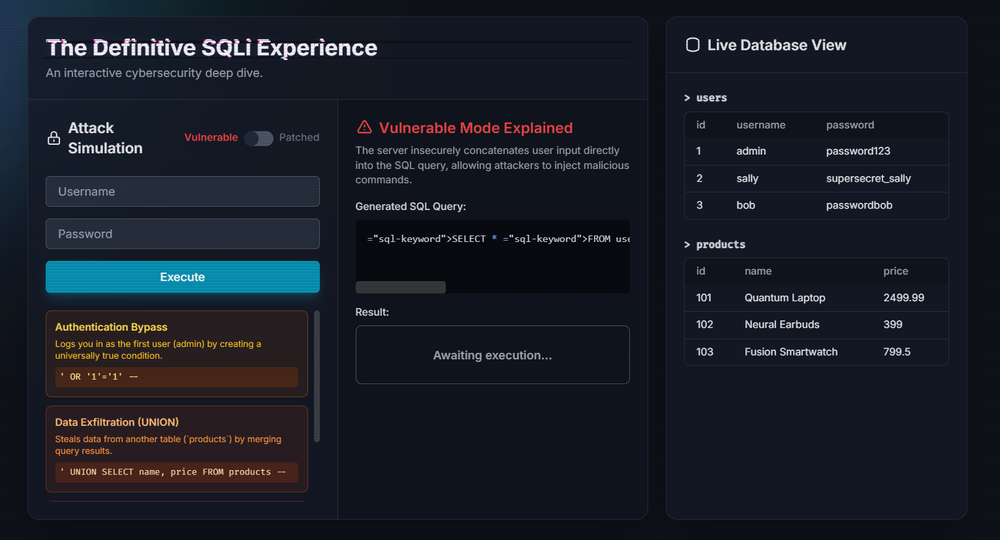
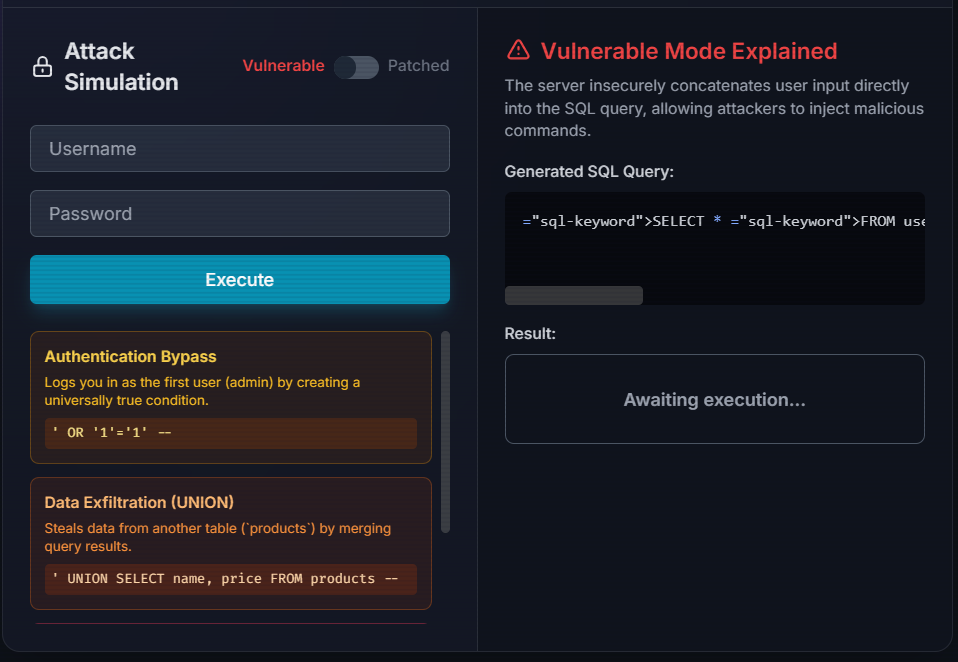
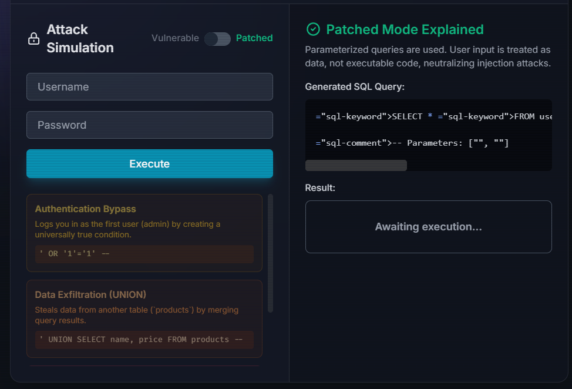

# 🛡️ The Definitive SQL Injection Experience


**The Definitive SQL Injection Experience** is an **interactive web simulation** that demonstrates **SQL Injection (SQLi)** attacks, their risks, and how **parameterized queries** protect against them.

It provides a **safe, isolated environment** to experiment with SQLi concepts without touching real databases — perfect for learners, cybersecurity students, and enthusiasts.

---

## 📑 Table of Contents

* [Live Demo](#-live-demo)
* [Screenshots](#-screenshots)
* [Features](#-features)
* [Project Structure](#-project-structure)
* [Getting Started](#-getting-started)
* [Technologies Used](#-technologies-used)
* [Learning Objectives](#-learning-objectives)
* [Future Enhancements](#-future-enhancements)
* [Disclaimer](#-disclaimer)
* [Licence](#-licence)

---

## 🌐 Live Demo

🔗 **[View the Simulation](https://sanilpanchal23.github.io/Interactive-SQL-Platform/)**

*(Hosted via GitHub Pages)*

---

## 📸 Screenshots

| Dashboard Overview                          | Vulnerable Mode                                      | Patched Mode                                   |
| ------------------------------------------- | ---------------------------------------------------- | ---------------------------------------------- |
|  |  |  |


## ✨ Features

* **🎨 Immersive UI**

  * Aurora background animations
  * Glitchy cyberpunk headers
  * Glassmorphism panels with smooth transitions
  * Scanline and terminal-style effects

* **🧑‍💻 Attack Simulation**

  * **Authentication Bypass** (`' OR '1'='1' --`)
  * **Data Exfiltration** using `UNION SELECT`
  * **Blind Injection** via `SLEEP()`

* **🔐 Mode Toggle**

  * **Vulnerable Mode** → Inputs concatenated directly into SQL queries
  * **Patched Mode** → Queries parameterized, immune to injection

* **📊 Live Database Viewer**

  * Mock tables (`users`, `products`)
  * Highlights rows affected by attacks

* **🎯 SQL Syntax Highlighting**

  * Visual distinction for keywords, strings, numbers, comments, operators, and injected payloads

* **🧾 Step-by-Step Explanations**

  * Shows SQL queries executed in **Vulnerable** vs **Patched** mode
  * Provides real-time explanations of what happens during attacks

---

## 📂 Project Structure

```text
.
├── index.html        # Main simulation (UI + logic)
├── tailwind.css      # Styling via CDN
├── assets/           # Screenshots and UI assets
│   ├── screenshot-overview.png
│   ├── screenshot-vulnerable.png
│   ├── screenshot-patched.png
└── README.md         # Project documentation
```

All logic is contained in `index.html`. TailwindCSS and Google Fonts are loaded via CDN.

---

## 🚀 Getting Started

### 1. Clone this repo

```bash
git clone https://github.com/Sanilpanchal23/Interactive-SQL-Platform.git
cd sql-injection-experience
```

### 2. Open in browser

No build tools are required — just open:

```bash
open index.html
```

*(or double-click it)*

---

## 🛠️ Technologies Used

* **HTML5** – Semantic markup for structure
* **TailwindCSS** – Modern, responsive styling
* **Vanilla JavaScript** – Simulation logic
* **Google Fonts (Inter + Fira Code)** – Typography
* **SVG Icons** – UI elements

---

## 🧑‍🏫 Learning Objectives

* Understand how insecure query concatenation leads to **SQL Injection**
* Observe the impact of common SQLi attack vectors
* Learn how **prepared statements / parameterized queries** prevent injection

---

## 🌟 Future Enhancements

* Add **Error-Based SQLi** simulation
* Include **Stored Procedure injection scenarios**
* Add a **Defensive Coding Best Practices panel**

---

## ⚠️ Disclaimer

This project is **educational only**.
Do **not** use these techniques on systems you do not own or have explicit permission to test.

---

## 📜 Licence

MIT License © 2025 **\[Sanil Panchal]**

---

✨ **The Definitive SQL Injection Experience – Learn SQLi Safely and Understand the Power of Parameterized Queries.**

